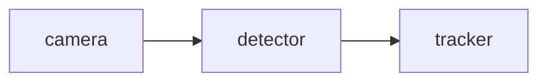

# RoboPilot

[English](README.md) | [Chinese](README.zh-CN.md)

Lightweight offline developer tooling for ROS-style robotics workflows.

RoboPilot helps robotics learners and developers scaffold ROS-style Python packages, analyze common robotics error logs, and turn simple software pipelines into Mermaid workflow diagrams. The current MVP is intentionally local, reproducible, and hardware-friendly: no ROS2 installation, GPU, Docker, OpenAI API, or heavy framework is required.

## Core Capabilities

- `generate`: create a ROS-style Python package skeleton from a natural language task description.
- `debug`: analyze robotics-related error logs with offline rule-based diagnostics.
- `graph`: convert arrow-based robotics pipelines into Mermaid diagrams.

## Quick Start

Clone and install:

```bash
git clone https://github.com/J1angJJ/RoboPilot.git
cd RoboPilot
python -m venv .venv
```

Activate the environment.

Windows:

```bash
.venv\Scripts\activate
```

macOS/Linux:

```bash
source .venv/bin/activate
```

Install in editable mode:

```bash
pip install -e ".[dev]"
```

Check the CLI:

```bash
robopilot --help
```

## Demo

Generate a ROS-style package:

```bash
robopilot generate --name demo_detector --task "Create an object detection node subscribing to camera images and publishing bounding boxes."
```

Analyze a robotics error log:

```bash
robopilot debug --log examples/error_logs/cv_bridge_missing.txt
```

Generate a Mermaid workflow graph:

```bash
robopilot graph --pipeline "camera -> detector -> tracker -> planner -> controller"
```

Write a Mermaid graph to a file:

```bash
robopilot graph --pipeline "camera -> detector -> tracker" --output examples/graphs/demo_pipeline.mmd
```

A longer walkthrough is available in [`docs/demo_script.md`](docs/demo_script.md).

## Example Outputs

Static examples are included for GitHub preview and demos:

- Generated package: [`examples/generated_projects/demo_detector/`](examples/generated_projects/demo_detector/)
- Generator prompt: [`examples/prompts/demo_detector.txt`](examples/prompts/demo_detector.txt)
- Error logs: [`examples/error_logs/`](examples/error_logs/)
- Pipeline input: [`examples/pipelines/demo_pipeline.txt`](examples/pipelines/demo_pipeline.txt)
- Mermaid graph: [`examples/graphs/demo_pipeline.mmd`](examples/graphs/demo_pipeline.mmd)

Generated package layout:

```txt
examples/generated_projects/demo_detector/
|-- package.xml
|-- setup.py
|-- setup.cfg
|-- README.md
|-- launch/
|   `-- demo_detector.launch.py
|-- config/
|   `-- params.yaml
`-- demo_detector/
    |-- __init__.py
    `-- detector_node.py
```

Mermaid graph output:



## Project Status

RoboPilot is an early MVP focused on offline, lightweight robotics developer workflows.

Implemented:

- MVP 0.1: Offline ROS-style Package Generator
- MVP 0.2: Robotics Error Log Debugger
- MVP 0.3: Workflow Diagram Generator

Not included yet:

- Real ROS2 runtime execution
- LLM-powered generation
- RAG
- Streamlit or Gradio UI
- VSCode extension
- Robot deployment tooling

## Roadmap Summary

Near-term roadmap:

1. MVP 0.4: Prompt-driven template selection
2. MVP 0.5: Optional LLM-assisted generation while keeping offline mode
3. MVP 0.6: Lightweight demo UI

Longer-term direction:

- Project inspection for ROS-style workspaces
- Better debugging suggestions for robotics learners
- AI-assisted patch generation
- Workflow visualization and explanation

See [`roadmap.md`](roadmap.md) for the full roadmap.

## Development Notes

Run tests:

```bash
pytest
```

On some Windows setups, pytest may not be able to access the default user temp directory. In that case, run tests with a project-local temp directory:

```powershell
New-Item -ItemType Directory -Path .pytest_tmp -Force
python -m pytest --basetemp=".pytest_tmp" -p no:cacheprovider
```

Generated projects are written to `outputs/` by default. That directory is ignored by Git. Static showcase examples live under `examples/`.

## Project Structure

```txt
robopilot/
|-- README.md
|-- README.zh-CN.md
|-- roadmap.md
|-- pyproject.toml
|-- src/
|   `-- robopilot/
|       |-- main.py
|       |-- generator/
|       |-- debugger/
|       |-- graph/
|       `-- utils/
|-- examples/
|-- tests/
`-- docs/
```

## License

MIT License.
