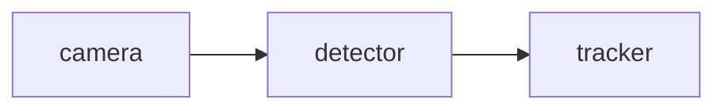

# RoboPilot

[English](README.md) | [Chinese](README.zh-CN.md)

[](https://github.com/J1angJJ/RoboPilot/actions/workflows/tests.yml)

Lightweight offline developer tooling for ROS-style robotics workflows.

RoboPilot helps robotics learners and developers scaffold ROS-style Python packages, analyze common robotics error logs, and turn simple software pipelines into Mermaid workflow diagrams. The default workflow is intentionally local, reproducible, and hardware-friendly: no ROS2 installation, GPU, Docker, OpenAI API, or heavy framework is required.

## Core Capabilities

- `plan`: convert a robotics task into a readable `robopilot.yaml` ProjectSpec.
- `refine`: update an existing ProjectSpec into a new refined spec with offline rules or an optional LLM provider.
- `diff`: compare two ProjectSpec files with a static, read-only report.
- `plan --planner llm`: optional ProjectSpec-only OpenAI planner for configured environments.
- `validate`: check a saved ProjectSpec before generation.
- `generate`: create a ROS-style Python package from a task or a saved ProjectSpec.
- `inspect`: statically inspect a generated or ROS-style project directory.
- `repair-suggest`: suggest safe repairs from inspection issues without modifying files.
- `report`: export a static Markdown report combining inspection and repair suggestions.
- `debug`: analyze robotics-related error logs with offline rule-based diagnostics.
- `graph`: convert arrow-based robotics pipelines into Mermaid diagrams.

## Quick Start

Clone and install:

```bash
git clone https://github.com/J1angJJ/RoboPilot.git
cd RoboPilot
python -m venv .venv
```

Activate the environment.

Windows:

```bash
.venv\Scripts\activate
```

macOS/Linux:

```bash
source .venv/bin/activate
```

Install in editable mode:

```bash
pip install -e ".[dev]"
```

Optional LLM planning and refinement support:

```bash
pip install -e ".[dev,llm]"
```

Check the CLI:

```bash
robopilot --help
```

## Demo

Generate a ROS-style package:

```bash
robopilot generate --name demo_detector --task "Create an object detection node subscribing to camera images and publishing bounding boxes."
```

Spec-first workflow:

```bash
robopilot plan --name demo_detector --task "Create an object detection node subscribing to camera images and publishing bounding boxes." --output robopilot.yaml
robopilot refine --spec robopilot.yaml --instruction "Add a tracker node after the detector" --planner rule --output refined.yaml
robopilot diff --old robopilot.yaml --new refined.yaml
robopilot validate --spec refined.yaml
robopilot generate --spec refined.yaml
```

`refine` writes a new spec by default. It does not modify the original
`robopilot.yaml`; no `--in-place` mode exists yet. The default planner is
`rule` and remains fully offline.

Optional LLM-assisted refinement:

```bash
robopilot refine --spec robopilot.yaml --instruction "Add a tracker node after the detector" --planner llm --model gpt-4.1-mini --output llm_refined.yaml
robopilot diff --old robopilot.yaml --new llm_refined.yaml
```

Real LLM refinement requires `OPENAI_API_KEY`. The LLM must return a full
ProjectSpec-compatible JSON or YAML document, RoboPilot validates it before
writing, and the LLM never writes project files or generated code directly.
Run `robopilot diff` before generating from an LLM-refined spec.

`diff` is static and read-only. It validates both specs, compares fields,
nodes, topics, files, and notes, and can also print deterministic JSON:

```bash
robopilot diff --old robopilot.yaml --new refined.yaml --json
```

Planner selection:

```bash
robopilot plan --name demo_detector --task "Create an object detection pipeline" --planner rule
robopilot plan --name demo_detector --task "Create an object detection pipeline" --planner llm
robopilot plan --name demo_detector --task "Create an object detection pipeline" --planner llm --model gpt-4.1-mini
```

The default planner is `rule` and remains fully offline. The optional `llm`
planner reads `OPENAI_API_KEY` from the environment and uses
`ROBOPILOT_LLM_MODEL` or `--model` for the model name. It is ProjectSpec-only:
the model must return structured JSON or YAML, RoboPilot validates that spec
before generation, and the model never writes generated files or code directly.

Example environment file:

```bash
OPENAI_API_KEY=
ROBOPILOT_LLM_MODEL=gpt-4.1-mini
```

Inspect a generated project:

```bash
robopilot inspect examples/generated_projects/demo_detector
robopilot inspect examples/generated_projects/demo_detector --json
```

Suggest safe repairs without modifying files:

```bash
robopilot repair-suggest examples/generated_projects/demo_detector
robopilot repair-suggest examples/generated_projects/demo_detector --json
```

Export a static Markdown report:

```bash
robopilot report examples/generated_projects/demo_detector
robopilot report examples/generated_projects/demo_detector --output report.md
```

Report generation is static and read-only. RoboPilot does not execute ROS2,
launch files, colcon, or generated Python code.

Generate other template types:

```bash
robopilot generate --name camera_reader --task "Create a camera subscriber for webcam frames."
robopilot generate --name base_controller --task "Create a velocity controller publishing cmd_vel motion commands."
robopilot generate --name perception_stack --task "Create a camera -> detector -> tracker perception workflow."
robopilot generate --name helper_node --task "Create a simple heartbeat node."
```

Analyze a robotics error log:

```bash
robopilot debug --log examples/error_logs/cv_bridge_missing.txt
```

Generate a Mermaid workflow graph:

```bash
robopilot graph --pipeline "camera -> detector -> tracker -> planner -> controller"
```

Write a Mermaid graph to a file:

```bash
robopilot graph --pipeline "camera -> detector -> tracker" --output examples/graphs/demo_pipeline.mmd
```

A longer walkthrough is available in [`docs/demo_script.md`](docs/demo_script.md).

## Example Outputs

Static examples are included for GitHub preview and demos:

- Generated package: [`examples/generated_projects/demo_detector/`](examples/generated_projects/demo_detector/)
- Generator prompt: [`examples/prompts/demo_detector.txt`](examples/prompts/demo_detector.txt)
- Error logs: [`examples/error_logs/`](examples/error_logs/)
- Pipeline input: [`examples/pipelines/demo_pipeline.txt`](examples/pipelines/demo_pipeline.txt)
- Mermaid graph: [`examples/graphs/demo_pipeline.mmd`](examples/graphs/demo_pipeline.mmd)

Generated package layout:

```txt
examples/generated_projects/demo_detector/
|-- package.xml
|-- setup.py
|-- setup.cfg
|-- README.md
|-- robopilot.yaml
|-- launch/
|   `-- demo_detector.launch.py
|-- config/
|   `-- params.yaml
`-- demo_detector/
    |-- __init__.py
    `-- detector_node.py
```

Mermaid graph output:



## Project Status

RoboPilot is an early v0.11.0 MVP focused on lightweight robotics developer workflows with offline defaults. See [`CHANGELOG.md`](CHANGELOG.md) for release notes.

Implemented:

- MVP 0.1: Offline ROS-style Package Generator
- MVP 0.2: Robotics Error Log Debugger
- MVP 0.3: Workflow Diagram Generator
- MVP 0.4: Prompt-driven Template Selection
- MVP 0.5: Spec-first Generation
- MVP 0.6: Project Inspector
- v0.5.0: Project Repair Suggestions
- v0.6.0: Project Report Export
- v0.7.0: Planner Interface and Optional LLM Planner
- v0.8.0: Real OpenAI Provider Integration for ProjectSpec planning
- v0.9.0: Rule-based ProjectSpec Refinement
- v0.10.0: Static ProjectSpec Diff
- v0.11.0: Optional LLM-assisted ProjectSpec Refinement

Not included yet:

- Real ROS2 runtime execution
- LLM-generated project files or code
- RAG
- Streamlit or Gradio UI
- VSCode extension
- Robot deployment tooling

## Roadmap Summary

Near-term roadmap:

1. Hardening provider-backed ProjectSpec planning and refinement
2. Lightweight demo UI
3. Better static reports and repair guidance

Longer-term direction:

- Better debugging suggestions for robotics learners
- AI-assisted patch generation
- Workflow visualization and explanation

See [`roadmap.md`](roadmap.md) for the full roadmap.

## Development Notes

Run tests:

```bash
pytest
```

On some Windows setups, pytest may not be able to access the default user temp directory. In that case, run tests with a project-local temp directory:

```powershell
New-Item -ItemType Directory -Path .pytest_tmp -Force
python -m pytest --basetemp=".pytest_tmp" -p no:cacheprovider
```

Generated projects are written to `outputs/` by default. That directory is ignored by Git. Static showcase examples live under `examples/`.

## Project Structure

```txt
robopilot/
|-- README.md
|-- README.zh-CN.md
|-- roadmap.md
|-- pyproject.toml
|-- src/
|   `-- robopilot/
|       |-- main.py
|       |-- generator/
|       |-- diff/
|       |-- debugger/
|       |-- graph/
|       |-- inspector/
|       |-- planner/
|       |-- refiner/
|       |-- repair/
|       |-- report/
|       `-- utils/
|-- examples/
|-- tests/
`-- docs/
```

## License

MIT License.
