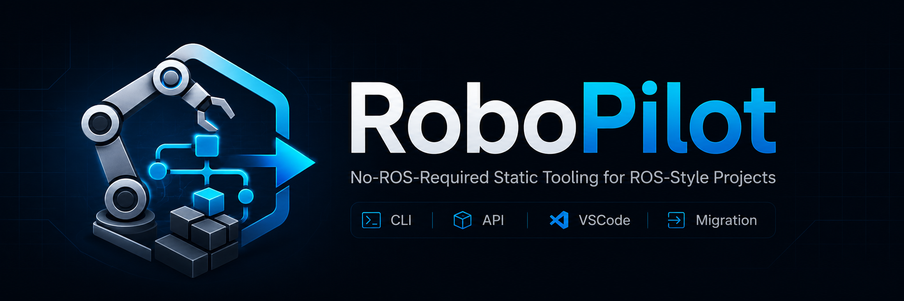

# RoboPilot

[English](README.md) | [中文文档](docs/zh-CN/README.md)

[](https://github.com/J1angJJ/RoboPilot/actions/workflows/tests.yml)
[](https://pypi.org/project/robopilot/)
[](https://pypi.org/project/robopilot/)
[](https://marketplace.visualstudio.com/items?itemName=j1angjj.robopilot-vscode)



RoboPilot 是一个无需 ROS 环境即可使用的 ROS 风格工程静态辅助工具链，面向静态检查、依赖分析和 ROS1 到 ROS2 迁移 scaffold 工作流。

它帮助机器人学习者和开发者在不安装 ROS、ROS2、catkin、colcon、仿真器或机器人硬件的情况下，规划、验证、生成、检查、更新、回滚、分析和迁移 ROS/ROS2 风格项目结构。

RoboPilot 不会运行 ROS、ROS2、launch 文件、生成节点、`catkin_make` 或 `colcon`。迁移 scaffold 是保守的人工审查起点，不是完整自动迁移。

## 快速开始

当前支持 Python 3.10 和 3.11。包元数据声明 `>=3.10,<3.12`；Python 3.12 暂不声明支持，Python 3.13 暂不支持。

从 PyPI 安装：

```bash
pip install robopilot
robopilot --help
```

安装 VSCode 扩展：

```bash
code --install-extension j1angjj.robopilot-vscode
```

从源码安装只作为开发方式：

```bash
python -m venv .venv
.venv\Scripts\activate
python -m pip install -U pip
pip install -e ".[dev]"
```

Windows 上如果 pytest 临时目录有权限问题：

```bash
python -m pytest --basetemp=".pytest_tmp" -p no:cacheprovider
```

## 核心工作流

Spec-first 生成：

```bash
robopilot plan --name demo_detector --task "Create an object detection pipeline" --output robopilot.yaml
robopilot validate --spec robopilot.yaml
robopilot generate --spec robopilot.yaml
```

静态分析：

```bash
robopilot detect path/to/project
robopilot inspect-ros1 path/to/ros1_package
robopilot inspect-ros2 path/to/ros2_package
robopilot deps path/to/project
```

ROS1 到 ROS2 迁移辅助：

```bash
robopilot migrate-plan --from path/to/ros1_package --to ros2 --output migration_plan.yaml
robopilot migrate-plan-validate --plan migration_plan.yaml
robopilot migrate-scaffold-preview --plan migration_plan.yaml
robopilot migrate-scaffold --plan migration_plan.yaml --output path/to/ros2_scaffold
robopilot migrate-scaffold-validate --plan migration_plan.yaml --scaffold path/to/ros2_scaffold
robopilot migrate-scaffold-report --plan migration_plan.yaml --scaffold path/to/ros2_scaffold --output scaffold_report.md
```

迁移 scaffold 是保守的人工审查起点，不是完整自动迁移。生成的 scaffold 没有经过 ROS2 runtime validation。

## 中文文档

- [中文文档入口](docs/zh-CN/README.md)
- [ROS1 到 ROS2 迁移脚手架教程](docs/zh-CN/tutorial_ros1_to_ros2_migration.md)
- [VSCode 辅助迁移教程](docs/zh-CN/tutorial_vscode_migration_workflow.md)
- [常见问题排查](docs/zh-CN/troubleshooting.md)
- [主要工作流](docs/zh-CN/workflows.md)
- [VSCode 扩展](docs/zh-CN/vscode_extension.md)
- [VSCode Marketplace](docs/zh-CN/vscode_marketplace.md)
- [已知限制](docs/zh-CN/known_limitations.md)
- [演示讲稿](docs/zh-CN/demo_walkthrough.md)

英文详细文档仍在 `docs/` 目录中。

## 项目状态

当前稳定版本：`v2.0.1`。

RoboPilot v2.0.x 是当前 no-ROS-required 静态 ROS 工程工作流的稳定阶段完成版本线。v2.0.1 是 v2.0 发布后的公开呈现 polish patch，不是 breaking rewrite。

RoboPilot 的 v2.0.x 稳定基线是 no-ROS-required 静态工程工作流：

```txt
plan -> refine -> diff -> validate -> generate
      -> apply-preview -> apply-plan -> apply -> rollback -> history
      -> inspect -> repair-suggest -> report
      -> detect -> inspect-ros1 -> inspect-ros2 -> deps
      -> migrate-plan -> migrate-plan-validate -> migrate-plan-diff -> migrate-preview
      -> migrate-scaffold-preview -> migrate-scaffold -> migrate-scaffold-validate
      -> migrate-scaffold-report
```

VSCode extension 是 RoboPilot CLI 的薄包装，支持迁移 scaffold review workflow，并已在 Visual Studio Marketplace 上架，extension id 为 `j1angjj.robopilot-vscode`。

```bash
pip install robopilot
code --install-extension j1angjj.robopilot-vscode
```

扩展不会运行 ROS、ROS2、`catkin_make`、`colcon`、launch 文件或生成节点，也不会自动完成完整迁移。

Python package 版本号是 `2.0.1`；面向用户的 tag / release 名称应使用 `v2.0.1`。VSCode extension 单独版本化，当前仍使用 Marketplace 上的 `j1angjj.robopilot-vscode`。

## 开发

运行测试：

```bash
python -m pytest
```

编码检查：

```bash
python -m pytest tests/test_docs_encoding.py
```

## 路线图与研究

- [Roadmap](roadmap.md)
- [2.x Research Planning](docs/research/README.md)

## License

MIT
