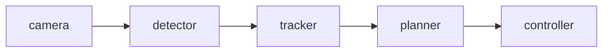

# Roadmap

RoboPilot is developed as a lightweight AI-native robotics development assistant.

The project will be built step by step, starting from an offline local generator and gradually evolving into an AI-assisted robotics workflow tool.

## MVP 0.1: Offline ROS-style Package Generator

Goal:

Build a local command-line tool that generates a ROS-style Python package skeleton from a task description.

Input example:

```txt
Create an object detection node subscribing to camera images and publishing bounding boxes.
```

Output example:

```txt
outputs/demo_detector/
├─ package.xml
├─ setup.py
├─ setup.cfg
├─ README.md
├─ launch/
│  └─ demo_detector.launch.py
├─ config/
│  └─ params.yaml
└─ demo_detector/
   ├─ __init__.py
   └─ detector_node.py
```

Requirements:

- No real ROS2 installation required
- No OpenAI API required
- No GPU required
- CLI command available
- Basic pytest coverage

Target command:

```bash
robopilot generate --name demo_detector --task "Create an object detection node subscribing to camera images and publishing bounding boxes."
```

## MVP 0.2: Robotics Error Log Debugger

Goal:

Analyze pasted robotics-related error logs and provide structured debugging suggestions.

Supported examples:

- Python import errors
- OpenCV camera errors
- PyTorch CUDA errors
- ROS-style dependency errors
- colcon-like build errors
- missing package errors

Expected command:

```bash
robopilot debug --log examples/error_logs/cv_bridge_missing.txt
```

Expected output:

```txt
Diagnosis:
The error suggests that cv_bridge is missing or not visible in the current Python environment.

Possible causes:
1. ROS environment not sourced.
2. cv_bridge not installed.
3. Python environment mismatch.

Suggested fixes:
1. Check ROS setup script.
2. Verify package installation.
3. Check Python interpreter path.
```

## MVP 0.3: Workflow Diagram Generator

Goal:

Generate Mermaid diagrams from robotics pipeline descriptions.

Input example:

```txt
camera -> detector -> tracker -> planner -> controller
```

Output example:



Expected command:

```bash
robopilot graph --pipeline "camera -> detector -> tracker -> planner -> controller"
```

## MVP 0.4: Prompt-driven Template Selection

Goal:

Improve the generator so that it selects different node templates based on the task description.

Possible templates:

- camera subscriber
- object detector
- topic publisher
- controller node
- sensor processing node
- robot workflow package

This stage may still be offline and rule-based.

## MVP 0.5: LLM-assisted Generation

Goal:

Add optional LLM-powered project generation.

Requirements:

- Keep offline mode available
- Use environment variables for API keys
- Never commit secrets
- Store prompts separately
- Make generated output reproducible where possible

Possible command:

```bash
robopilot generate --name demo_detector --task "..." --llm
```

## MVP 0.6: Streamlit Demo

Goal:

Create a lightweight web demo for showcasing RoboPilot.

Features:

- Task input box
- Generate project button
- Preview generated files
- Error log analysis panel
- Workflow graph preview

## Future Direction: Robotics Developer Copilot

Possible future features:

- VSCode extension
- Multi-file project editing
- AI-assisted patch generation
- Local project inspection
- ROS graph explanation
- Robotics paper-to-code scaffolding
- Vision-language robotics workflow support
- Integration with simulation tools
- Integration with real ROS2 projects

## Non-goals for Early Versions

RoboPilot will not focus on the following in early versions:

- Real robot deployment
- Heavy model training
- Full ROS2 runtime execution
- SLAM implementation
- Reinforcement learning training
- Large-scale VLA model inference
- Embedded low-level driver development

## Development Priorities

Priority order:

1. Make it runnable.
2. Make it understandable.
3. Make it testable.
4. Make it easy to demo.
5. Make it AI-assisted.
6. Make it extensible.

The project should grow like a real developer tool, not like a one-time demo script.
